<div align="center">

# 📧 expo-resend-guide

### The complete, from-first-principles guide to sending emails from an Expo Router app using Resend

[](https://expo.dev)
[](https://reactnative.dev)
[](https://docs.expo.dev/router/introduction/)
[](https://resend.com)
[](https://developer.mozilla.org/en-US/docs/Web/JavaScript)
[](./LICENSE)

**No TypeScript. No fluff. Every line of code explained.**

</div>

---

## 📖 Table of Contents

1. [Introduction](#1-introduction)
2. [Features](#2-features)
3. [Architecture](#3-architecture)
4. [Folder Structure](#4-folder-structure)
5. [Client vs Server](#5-client-vs-server)
6. [Environment Variables](#6-environment-variables)
7. [Installation](#7-installation)
8. [Expo Router API Routes](#8-expo-router-api-routes)
9. [Backend Code](#9-backend-code)
10. [Frontend Code](#10-frontend-code)
11. [Complete Request Flow](#11-complete-request-flow)
12. [Deployment](#12-deployment)
13. [Security](#13-security)
14. [Common Errors](#14-common-errors)
15. [FAQ](#15-faq)
16. [Glossary](#16-glossary)

---

## 1. Introduction

> **📘 Chapter Goal:** By the end of this chapter you will understand *why*
> this repository exists, and why the architecture it teaches is the
> correct way to send email from a mobile app.

### 1.1 What is Resend?

**Resend** is an email-sending platform built for developers. Instead of
configuring a raw mail server, you call a simple HTTP API (or use an
official SDK) and Resend handles the hard parts of email delivery:
authentication with mail providers, retries, deliverability reputation,
bounce/complaint handling, and analytics.

Think of Resend as "Stripe, but for email." You don't build a payment
processor from scratch — you call Stripe. You don't build an email
delivery system from scratch — you call Resend.

### 1.2 What problem does it solve?

Sending email correctly is deceptively hard. A naive attempt looks easy
("just connect to a mail server and send bytes"), but in practice you run
into:

| Problem | Why it's hard |
|---|---|
| Deliverability | Gmail/Outlook silently drop email from unknown/unreputable servers |
| Authentication | You need SPF, DKIM, and DMARC DNS records configured correctly |
| Retry logic | Mail servers can be temporarily unavailable — you need retries |
| Bounce handling | You need to know when an email failed and why |
| Scaling | Sending 10 emails is easy; sending 10,000 reliably is not |
| Compliance | Unsubscribe links, spam law compliance (CAN-SPAM, GDPR) |

Resend solves all of this behind a single API call.

### 1.3 Why should developers use it?

- **Simple API** — one HTTP request sends an email.
- **Official SDKs** — including a first-class Node.js/JavaScript SDK.
- **Great deliverability** — Resend manages sending reputation for you.
- **Built for modern stacks** — works naturally with serverless functions,
  edge functions, and API routes like the ones Expo Router provides.
- **Free tier** — great for learning and small projects.

### 1.4 Why not SMTP?

SMTP (Simple Mail Transfer Protocol) is the underlying protocol email uses,
but connecting directly to an SMTP server from application code is painful:

- You must manage credentials, TLS connections, and low-level protocol
  details yourself.
- You get no dashboard, no analytics, no bounce webhooks out of the box.
- Deliverability is entirely on you — one misconfigured server can land
  every email in spam.

Resend (and platforms like it) wrap SMTP complexity behind a clean HTTP
API, so you interact with JSON instead of a decades-old text protocol.

### 1.5 Why not send emails directly from React Native?

This is the single most important architectural lesson in this repository.

> **⚠️ Warning:** Never call the Resend API directly from your React Native
> app. This would require embedding your **secret API key** inside the app
> bundle that ships to every user's phone.

Anyone can extract strings from an installed app's JavaScript bundle in
minutes. If your Resend secret key is in there, an attacker can:

- Steal your API key.
- Send unlimited email as *you*, using *your* Resend account and *your*
  billing.
- Get your Resend account suspended for abuse.

The fix is always the same: **put a server in between.** Your app talks to
your own backend (in this case, an Expo Router **API Route**), and only
that backend — which lives on a machine you control, not on the user's
phone — talks to Resend.

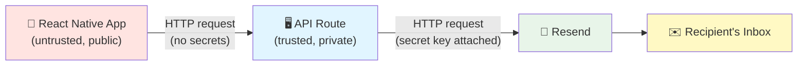

We will build exactly this pattern in this repository.

---

## 2. Features

<div align="center">


</div>

- ✅ **Pure JavaScript (JSX)** — zero TypeScript, beginner-friendly syntax.
- ✅ **Expo Router API Routes** — a real backend, no separate server needed.
- ✅ **Resend integration** — production-ready email sending.
- ✅ **Line-by-line explanations** — every snippet is fully annotated.
- ✅ **Mermaid diagrams throughout** — visualize every concept.
- ✅ **Security-first** — teaches proper secret management from day one.
- ✅ **Deployment guide** — ship to EAS Hosting with real commands.
- ✅ **Troubleshooting table** — common errors and their fixes.
- ✅ **30+ FAQ entries** — for absolute beginners.
- ✅ **Full glossary** — every technical term defined.


---

## 3. Architecture

> **📘 Chapter Goal:** Understand how all the pieces fit together before
> writing a single line of code.

### 3.1 High-Level Architecture

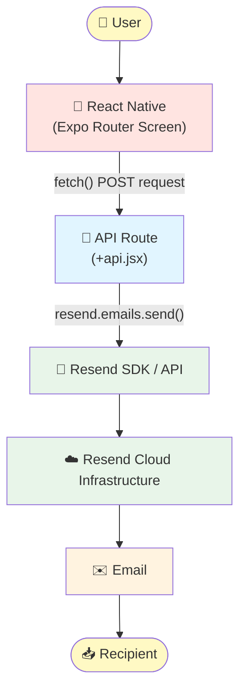

### 3.2 Where Code Actually Runs

This is the most confusing part for beginners, so let's be extremely
explicit.

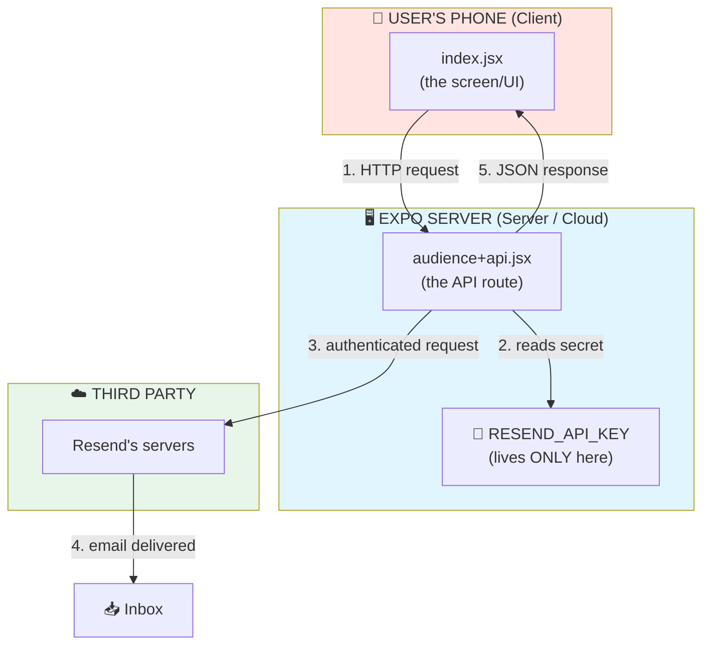


> **💡 Note:** `index.jsx` runs on the **user's device**. `audience+api.jsx`
> runs on **Expo's server infrastructure** (or wherever you deploy it).
> They live in the same repository and even the same folder tree, but they
> execute in two completely different places.

### 3.3 Sequence Diagram

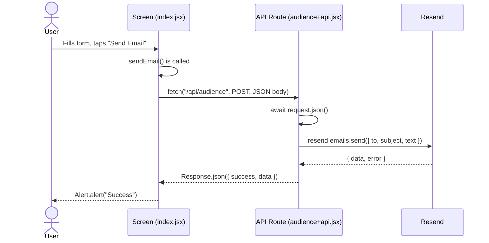

---

## 4. Folder Structure

> **📘 Chapter Goal:** Know what every file and folder is for before you
> touch any code.

```text
📦 expo-resend-guide
│
├── README.md                     # This file — the full guide
├── LICENSE                       # MIT license
├── .gitignore                    # Files Git should ignore
├── .env.example                  # Template for environment variables
├── app.json                      # Expo app configuration
│
├── assets/
│   ├── images/                   # Screenshots & exported diagrams
│   ├── diagrams/                 # Raw diagram source files
│   └── screenshots/              # App screenshots for docs
│
├── project/                      # Reserved for extra project docs/notes
│
└── src/
    └── app/                      # Expo Router's root directory
        ├── index.jsx             # The "/" screen (frontend UI)
        └── api/
            └── audience+api.jsx  # The "/api/audience" server route
```


### 4.1 Why each file exists

| File / Folder | Purpose |
|---|---|
| `README.md` | Documents the entire project — you're reading it. |
| `LICENSE` | Declares the legal terms under which this code can be reused. |
| `.gitignore` | Tells Git which files (like `node_modules` and `.env.local`) should never be committed. |
| `.env.example` | A **safe, secret-free** template showing which environment variables the project needs. Real values go in `.env.local`, which is git-ignored. |
| `app.json` | Configures the Expo app: its name, icon, routing plugin, and web output mode. |
| `assets/` | Static, non-code files: images, diagrams, screenshots. |
| `src/app/` | The root of Expo Router. **Every file in here becomes a route** unless it starts with an underscore or matches special naming patterns. |
| `src/app/index.jsx` | Because it's named `index`, this becomes the app's home route (`/`). This is a **screen** — it runs on the device. |
| `src/app/api/audience+api.jsx` | The `+api.jsx` suffix marks this as a **server route**, not a screen. It becomes reachable at `/api/audience`. |

> **📝 Best Practice:** Keep server-only logic (API keys, database calls,
> third-party SDK calls that require secrets) exclusively inside `+api.jsx`
> files. Never import server-only modules into screen files.

---

## 5. Client vs Server

> **📘 Chapter Goal:** Fully internalize the difference between "frontend"
> and "backend" — this is the conceptual foundation for everything else in
> this guide.

### 5.1 Definitions

| Term | Definition |
|---|---|
| **Frontend / Client** | The code that runs on the *user's device* — in our case, the React Native app running on a phone or in a browser. Its job is to display UI and react to user input. |
| **Backend / Server** | Code that runs on a machine *you* control (a cloud server, in our case Expo's hosting infrastructure). Its job is to do things the client shouldn't be trusted to do — like using secret API keys. |
| **API** | A defined set of rules that lets two programs talk to each other. Our API Route defines exactly one rule: "send a POST request with `to`, `subject`, and `message`, and I'll send an email." |
| **Request** | A message sent *from* the client *to* the server, asking it to do something. |
| **Response** | The message the server sends *back* to the client, containing the result. |

### 5.2 Visualizing the Boundary

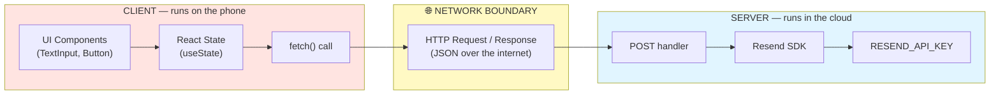


### 5.3 The Golden Rule

> **⚠️ Warning:** Anything shipped inside the React Native/Expo client
> bundle is **public**, even if a user would need technical skill to
> extract it. Never place secrets there. Only code running in
> `+api.jsx` files (or an equivalent backend) should ever see secret keys.

### 5.4 A Simple Analogy

Think of the client as a **customer at a restaurant counter**, and the
server as the **kitchen**:

- The customer (client) can ask for a dish (send a request).
- Only the kitchen (server) has access to the recipes, knives, and stove
  (secrets and privileged operations).
- The customer never walks into the kitchen — they place an order and wait
  for a plate to come back (the response).

---

## 6. Environment Variables

> **📘 Chapter Goal:** Understand what environment variables are, why we
> use them, and exactly which ones this project needs.

### 6.1 What is an environment variable?

An **environment variable** is a named value that lives outside your
source code, provided by the environment your program runs in (your
terminal, your build system, or your hosting provider). Instead of hard
coding a secret or a URL directly into a file, you reference a variable
name, and the actual value is injected at build- or run-time.

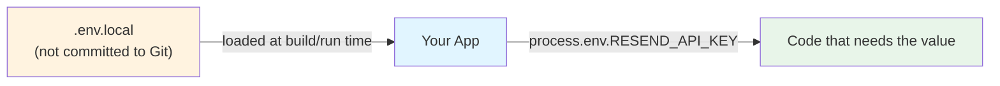

### 6.2 The variables this project uses

| Variable | Where it's used | Public or Secret? | Purpose |
|---|---|---|---|
| `RESEND_API_KEY` | `audience+api.jsx` (server) | 🔒 **Secret** | Authenticates requests to the Resend API. Must never reach the client. |
| `EXPO_PUBLIC_BASE_URL` | `index.jsx` (client) | 🌍 **Public** | The production URL of your deployed API, used when the app is built for release. |
| `EXPO_PUBLIC_BASE_URL_LOCAL` | `index.jsx` (client) | 🌍 **Public** | The local development server URL, used while running `npx expo start`. |

### 6.3 Why does `EXPO_PUBLIC_` exist?

Expo needs a way to know which environment variables are **safe to bundle
into client JavaScript** and which must stay **server-only**.

- Any variable prefixed with `EXPO_PUBLIC_` is intentionally embedded into
  the client bundle at build time. Use this prefix only for values that
  are safe for *anyone* to see (like a public base URL).
- Any variable **without** that prefix (like `RESEND_API_KEY`) is only
  available in server contexts — such as inside an Expo Router API route
  — and is never bundled into the app your users download.

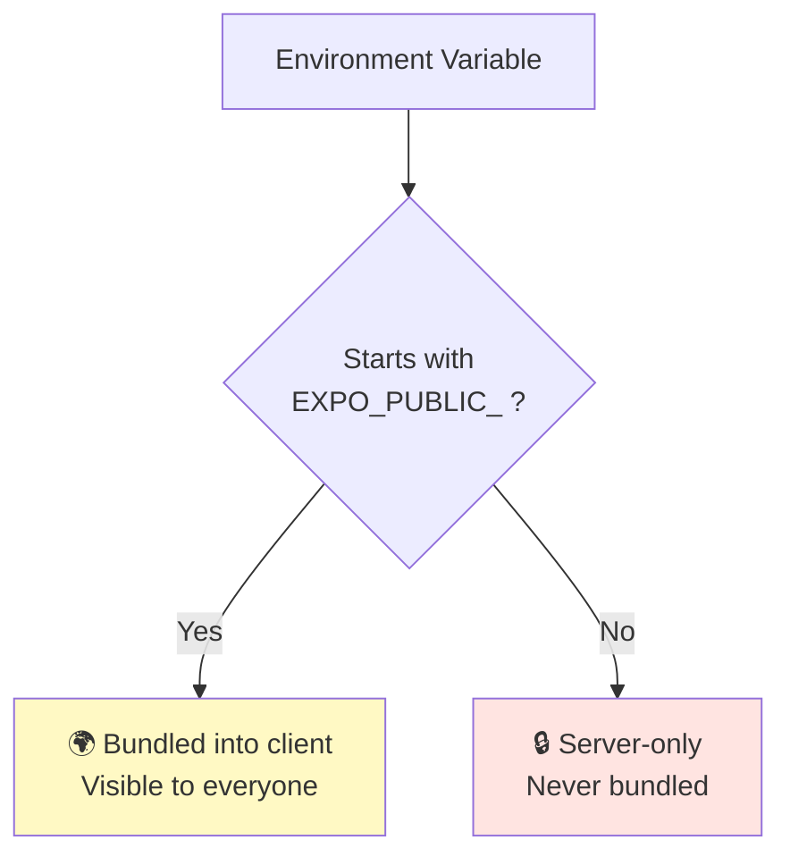

### 6.4 Why are API keys secret?

An API key is essentially a **password that proves you're allowed to use a
service on someone's behalf** — in this case, on behalf of your Resend
account. If it leaks:

- Anyone can send unlimited emails using your account and your quota.
- Your Resend account could be suspended for abuse originating from your
  leaked key.
- You could be billed for usage you never authorized.

> **📝 Best Practice:** Treat every API key like a password. Never commit
> it to Git, never post it in a screenshot, and rotate it immediately if
> you suspect it has leaked.


---

## 7. Installation

> **📘 Chapter Goal:** Get a working project on your machine, understanding
> what every command actually does — no step assumed as "obvious."

### 7.1 Prerequisites

| Requirement | Why you need it |
|---|---|
| [Node.js](https://nodejs.org) (LTS version) | Runs the JavaScript tooling for Expo and npm. |
| npm (comes with Node.js) | Installs project dependencies. |
| A [Resend account](https://resend.com) | Gives you an API key to send real emails. |
| [Expo Go app](https://expo.dev/go) *or* a simulator | Lets you preview the app on a device. |

### 7.2 Step-by-step

```bash
# 1. Clone this repository to your computer.
#    This downloads all project files from GitHub.
git clone https://github.com/your-username/expo-resend-guide.git

# 2. Move into the project folder.
#    All following commands must be run from inside this folder.
cd expo-resend-guide

# 3. Install all dependencies listed in package.json.
#    This downloads React, React Native, Expo, Expo Router,
#    and the Resend SDK into a node_modules folder.
npm install

# 4. Install the Resend SDK explicitly (if not already listed).
#    This is the official JavaScript library that talks to Resend's API.
npm install resend

# 5. Copy the environment variable template.
#    You will fill in real values in the new file, .env.local.
cp .env.example .env.local

# 6. Open .env.local and paste in your real Resend API key
#    and your local/prod URLs (see Chapter 6).

# 7. Start the Expo development server.
#    This starts a local server and shows a QR code you can scan
#    with the Expo Go app on your phone.
npx expo start
```

> **💡 Tip:** Keep the terminal running `npx expo start` open. It shows
> live logs from both your screen (`index.jsx`) and your API route
> (`audience+api.jsx`) while you develop.

> **⚠️ Warning:** Never run `git add .env.local`. It is already listed in
> `.gitignore`, but always double-check before committing, especially if
> you renamed the file.

---

## 8. Expo Router API Routes

> **📘 Chapter Goal:** Understand exactly how Expo Router turns a file into
> a live server endpoint.

### 8.1 What is a `+api.jsx` file?

Expo Router uses **file-based routing**: the location and name of a file
inside `src/app/` determines what URL it responds to. Normally, a file
becomes a **screen** the user can navigate to.

Adding the special suffix `+api` right before the extension — for example
`audience+api.jsx` — tells Expo Router: *"this file is not a screen, it's
a server function."* Instead of rendering UI, it exports functions that
handle HTTP requests directly.

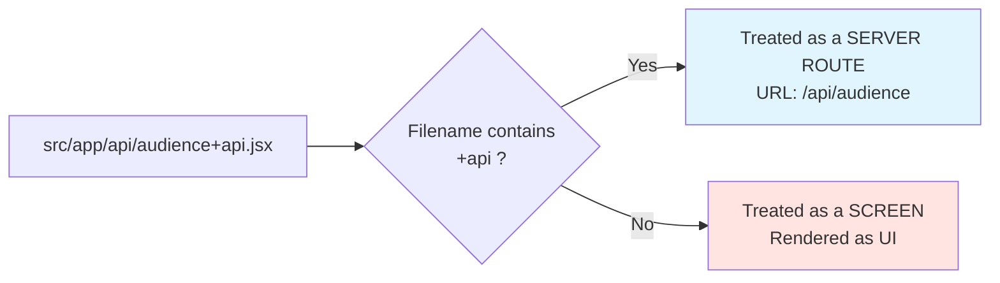

### 8.2 How routing works

The file's path relative to `src/app/` becomes its URL path:

| File path | Resulting URL |
|---|---|
| `src/app/index.jsx` | `/` |
| `src/app/api/audience+api.jsx` | `/api/audience` |

This mirrors how Next.js and many modern frameworks handle routing — the
folder structure *is* the routing table. No manual route configuration
file is required.

### 8.3 How POST requests work

**POST** is one of the standard HTTP methods. It signals "I am sending
data to be processed" (as opposed to **GET**, which signals "just give me
data, I'm not sending anything to change"). We use POST here because the
client is asking the server to *perform an action* (send an email) using
data it supplies (`to`, `subject`, `message`).

Inside a `+api.jsx` file, you export one async function per HTTP method
you want to support, using the method name as the export name:

```javascript
export async function GET(request) { /* handles GET /api/audience */ }
export async function POST(request) { /* handles POST /api/audience */ }
```

Our project only needs `POST`, since we're only ever *sending* an email,
never fetching one back.

### 8.4 How `Request` objects work

Every exported handler function automatically receives a standard **Web
API `Request` object** as its first argument. This is the same `Request`
object used in browsers and modern JavaScript runtimes — Expo Router
doesn't invent a new format. Useful methods include:

| Method | Purpose |
|---|---|
| `request.json()` | Parses the request body as JSON (returns a Promise). |
| `request.method` | The HTTP method used (`"POST"`, `"GET"`, etc). |
| `request.headers` | The HTTP headers sent with the request. |
| `request.url` | The full URL that was requested. |

### 8.5 How `Response.json()` works

To send data back to the client, you return a **Web API `Response`
object**. `Response.json(data, options)` is a convenient shortcut that:

1. Converts the `data` object into a JSON string.
2. Sets the `Content-Type: application/json` header automatically.
3. Optionally sets an HTTP status code via `options.status` (defaults to
   `200`).

```javascript
return Response.json({ success: true }, { status: 200 });
return Response.json({ error: "Bad request" }, { status: 400 });
```


---

## 9. Backend Code

> **📘 Chapter Goal:** Read `audience+api.jsx` top to bottom with a full
> explanation of every single line.

### 9.1 Full source

```jsx
import { Resend } from "resend";

const resend = new Resend(process.env.RESEND_API_KEY);

export async function POST(request) {
  try {
    const body = await request.json();

    const { to, subject, message } = body;

    if (!to || !subject || !message) {
      return Response.json(
        { error: "Missing required fields: to, subject, message" },
        { status: 400 }
      );
    }

    const { data, error } = await resend.emails.send({
      from: "Acme <onboarding@resend.dev>",
      to: [to],
      subject: subject,
      text: message,
    });

    if (error) {
      return Response.json({ error: error.message }, { status: 500 });
    }

    return Response.json({ success: true, data });
  } catch (err) {
    return Response.json(
      { error: "Something went wrong on the server." },
      { status: 500 }
    );
  }
}
```

### 9.2 Line-by-line explanation

| Line | Explanation |
|---|---|
| `import { Resend } from "resend";` | Imports the `Resend` class from the official `resend` npm package. This is the SDK that knows how to talk to Resend's API. |
| `const resend = new Resend(process.env.RESEND_API_KEY);` | Creates one instance of the Resend client, authenticated with our **secret** API key read from the server's environment. Because this file has no `EXPO_PUBLIC_` involved, this code only ever runs server-side, so the key is never exposed. |
| `export async function POST(request) {` | Declares the function that will handle any `POST` request to `/api/audience`. It's `async` because we'll use `await` inside it. `request` is the incoming `Request` object. |
| `try {` | Opens a try block so that any unexpected runtime error is caught gracefully instead of crashing the server response. |
| `const body = await request.json();` | Reads and parses the request's body as JSON. This pauses execution (`await`) until the full body has been read and parsed into a plain JavaScript object. |
| `const { to, subject, message } = body;` | Uses **object destructuring** to pull three named fields out of the parsed body into their own variables. |
| `if (!to \|\| !subject \|\| !message) {` | Validates that all three required fields were actually provided. `!to` is `true` if `to` is `undefined`, `null`, or an empty string. |
| `return Response.json({ error: ... }, { status: 400 });` | If validation fails, immediately responds with HTTP status `400` (Bad Request) and a JSON body describing the problem. `return` here stops the function early. |
| `const { data, error } = await resend.emails.send({ ... });` | Calls the Resend SDK's `emails.send()` method, which sends an HTTP request to Resend's API on our behalf. `await` pauses until Resend responds. The SDK resolves with an object containing either `data` (success) or `error` (failure). |
| `from: "Acme <onboarding@resend.dev>",` | The sender address. `onboarding@resend.dev` is a testing address Resend provides out of the box; in production you'd use a verified domain you own. |
| `to: [to],` | The recipient(s). Resend expects an array, so we wrap the single email string in `[ ]`. |
| `subject: subject,` | The email subject line, taken directly from the client's request. |
| `text: message,` | The plain-text body of the email. |
| `if (error) { ... }` | If Resend itself reports a failure (e.g. invalid recipient), we forward that error to the client with HTTP status `500` (Internal Server Error). |
| `return Response.json({ success: true, data });` | On success, responds with a JSON body confirming success and including whatever data Resend returned (like the email's ID). |
| `} catch (err) {` | Catches anything that throws unexpectedly — a malformed JSON body, a network failure, etc. |
| `return Response.json({ error: "Something went wrong..." }, { status: 500 });` | Sends a generic error response rather than leaking internal error details to the client. |

> **📝 Best Practice:** Always validate input on the server, even if the
> client also validates it. Client-side validation can always be bypassed.

---

## 10. Frontend Code

> **📘 Chapter Goal:** Read `index.jsx` top to bottom with a full
> explanation of every single line and every concept it uses.

### 10.1 Concepts used in this file

| Concept | What it means |
|---|---|
| `TextInput` | A React Native component that renders a native text input field on screen. |
| `Button` | A React Native component that renders a tappable button and runs a function when pressed. |
| `fetch()` | A built-in JavaScript function used to make HTTP requests (in our case, to our own API route). |
| `JSON.stringify()` | Converts a JavaScript object into a JSON-formatted string, which is the format HTTP bodies need to be sent as. |
| `await` | Pauses an `async` function until a Promise resolves, letting you write asynchronous code that reads top-to-bottom like synchronous code. |
| `async` | Marks a function as one that can use `await` inside it, and makes it always return a Promise. |
| `try / catch` | Lets you attempt code that might fail (`try`) and gracefully handle the failure (`catch`) instead of crashing the app. |
| `Alert` | A React Native API that shows a native popup dialog to the user. |

### 10.2 Full source

```jsx
import { useState } from "react";
import {
  View,
  Text,
  TextInput,
  Button,
  Alert,
  StyleSheet,
  ActivityIndicator,
} from "react-native";

const BASE_URL = __DEV__
  ? process.env.EXPO_PUBLIC_BASE_URL_LOCAL
  : process.env.EXPO_PUBLIC_BASE_URL;

export default function Index() {
  const [to, setTo] = useState("");
  const [subject, setSubject] = useState("");
  const [message, setMessage] = useState("");
  const [loading, setLoading] = useState(false);

  async function sendEmail() {
    setLoading(true);

    try {
      const response = await fetch(`${BASE_URL}/api/audience`, {
        method: "POST",
        headers: {
          "Content-Type": "application/json",
        },
        body: JSON.stringify({ to, subject, message }),
      });

      const result = await response.json();

      if (!response.ok) {
        throw new Error(result.error || "Failed to send email.");
      }

      Alert.alert("Success", "Your email was sent!");
      setTo("");
      setSubject("");
      setMessage("");
    } catch (error) {
      Alert.alert("Error", error.message);
    } finally {
      setLoading(false);
    }
  }

  return (
    <View style={styles.container}>
      <Text style={styles.title}>Send an Email</Text>

      <TextInput
        style={styles.input}
        placeholder="Recipient email"
        value={to}
        onChangeText={setTo}
        autoCapitalize="none"
        keyboardType="email-address"
      />

      <TextInput
        style={styles.input}
        placeholder="Subject"
        value={subject}
        onChangeText={setSubject}
      />

      <TextInput
        style={[styles.input, styles.textArea]}
        placeholder="Message"
        value={message}
        onChangeText={setMessage}
        multiline
      />

      {loading ? (
        <ActivityIndicator size="large" />
      ) : (
        <Button title="Send Email" onPress={sendEmail} />
      )}
    </View>
  );
}
```

### 10.3 Line-by-line explanation

| Line | Explanation |
|---|---|
| `import { useState } from "react";` | Imports React's `useState` hook, used to create pieces of component state that persist between re-renders. |
| `import { View, Text, ... } from "react-native";` | Imports the native UI building blocks we use: layout containers, text, inputs, buttons, alerts, styling, and a loading spinner. |
| `const BASE_URL = __DEV__ ? ... : ...;` | `__DEV__` is a global boolean Expo/React Native provides automatically: `true` while developing, `false` in a production build. This line picks the local URL during development and the production URL otherwise. |
| `export default function Index() {` | Declares the default-exported component for this file. Because the file is `index.jsx`, Expo Router renders this component for the `/` route. |
| `const [to, setTo] = useState("");` | Creates a state variable `to` (initially an empty string) plus a setter function `setTo` used to update it. Repeated for `subject`, `message`, and a `loading` boolean. |
| `async function sendEmail() {` | Declares the function that runs when the user taps "Send Email". Marked `async` because it uses `await` inside. |
| `setLoading(true);` | Immediately updates state to show a loading spinner and disable further taps while the request is in flight. |
| `try {` | Opens a try block so a failed request doesn't crash the app — it's instead caught and shown to the user. |
| `const response = await fetch(...)` | Sends an HTTP request to our own API route. `await` pauses this function until the network call finishes (success or failure). |
| `` `${BASE_URL}/api/audience` `` | Builds the full URL by combining the base URL (local or production) with the API route's path. |
| `method: "POST",` | Specifies this is a POST request, matching the `POST` handler we wrote in `audience+api.jsx`. |
| `headers: { "Content-Type": "application/json" },` | Tells the server the body of this request is JSON-formatted, so it can be parsed correctly with `request.json()`. |
| `body: JSON.stringify({ to, subject, message }),` | Converts our three pieces of state into a JSON string, which becomes the request's body. `fetch()` cannot send raw JavaScript objects — only strings, so this conversion is required. |
| `const result = await response.json();` | Parses the server's JSON response body into a JavaScript object. |
| `if (!response.ok) { throw new Error(...); }` | `response.ok` is `true` only for HTTP status codes 200–299. If the server responded with an error status, we manually throw so it's caught below. |
| `Alert.alert("Success", "Your email was sent!");` | Shows a native popup confirming success. |
| `setTo(""); setSubject(""); setMessage("");` | Clears the form fields after a successful send. |
| `} catch (error) {` | Catches any thrown error — network failure, server error, or the manually thrown error above. |
| `Alert.alert("Error", error.message);` | Shows a native popup with the error message so the user knows what went wrong. |
| `} finally {` | Runs regardless of success or failure. |
| `setLoading(false);` | Hides the spinner and re-enables the button. |
| `<TextInput value={to} onChangeText={setTo} .../>` | A controlled input: its displayed value always comes from state (`value={to}`), and every keystroke updates that state (`onChangeText={setTo}`), keeping the UI and state in sync. |
| `{loading ? <ActivityIndicator .../> : <Button .../>}` | Conditionally renders a spinner while `loading` is `true`, otherwise renders the send button. |

---

## 11. Complete Request Flow

> **📘 Chapter Goal:** See the entire journey of one button tap, from
> screen to inbox, in a single diagram.

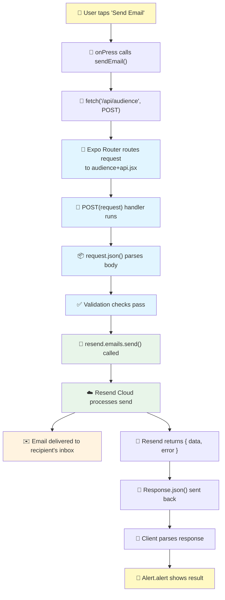

### 11.1 Step summary

```text
User
  ↓
Button (onPress)
  ↓
fetch()
  ↓
API Route (audience+api.jsx)
  ↓
Resend SDK
  ↓
Resend Cloud
  ↓
Recipient
```


---

## 12. Deployment

> **📘 Chapter Goal:** Understand how to take this project from your
> laptop to a live, publicly reachable URL using EAS Hosting.

### 12.1 What is `expo export`?

`expo export` builds a **static, deployable bundle** of your entire app —
including both the client screens and, because our `app.json` sets
`"output": "server"`, the server-side API routes as well. This produces a
`dist/` folder ready to be uploaded to a hosting provider.

```bash
# Builds the production bundle into the dist/ folder.
npx expo export
```

### 12.2 What is EAS Hosting?

**EAS Hosting** is Expo's own hosting platform, purpose-built to serve
Expo Router projects — including their API routes — without needing to
manage a separate server yourself. It takes the output of `expo export`
and serves it on a public URL.

### 12.3 Deploying

```bash
# 1. Install the EAS CLI globally (only needed once per machine).
npm install -g eas-cli

# 2. Log in to your Expo account.
eas login

# 3. Export the production build (client + API routes).
npx expo export

# 4. Deploy the exported build to EAS Hosting production.
eas deploy --prod
```

### 12.4 What happens internally during deployment

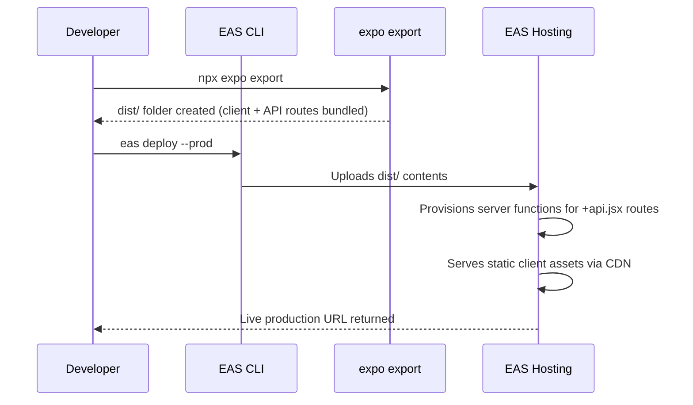

1. `expo export` compiles your JavaScript, bundles your screens for the
   web/native runtime, and separately packages each `+api.jsx` route as
   its own server function.
2. `eas deploy --prod` uploads this output to EAS Hosting.
3. EAS Hosting places static assets (like your compiled client) behind a
   CDN for fast global delivery, and deploys your API routes as
   serverless functions that spin up on demand to handle requests.
4. You receive a production URL — this is the value you should put in
   `EXPO_PUBLIC_BASE_URL`.

> **💡 Tip:** After your first deploy, update `.env.local`'s
> `EXPO_PUBLIC_BASE_URL` with the real URL EAS Hosting gives you, then
> redeploy so the client points at the correct production API.


---

## 13. Security

> **📘 Chapter Goal:** Leave this guide with a security mental model you
> can apply to any project, not just this one.

### 13.1 The core principles

| Principle | Explanation |
|---|---|
| **API Keys are passwords** | Treat `RESEND_API_KEY` exactly as you would treat a password — never share it, never commit it, rotate it if exposed. |
| **Environment variables separate config from code** | They let the same code run with different secrets/URLs in development vs production, without hardcoding either into source files. |
| **Secrets stay server-side, always** | Only code that runs somewhere *you* control (never the user's device) should ever read a secret. |
| **Client vs Server trust boundary** | Assume the client can be inspected, modified, or spoofed by its user. Never let the client alone decide something security-sensitive. |

### 13.2 Why the Resend SDK never belongs in the frontend

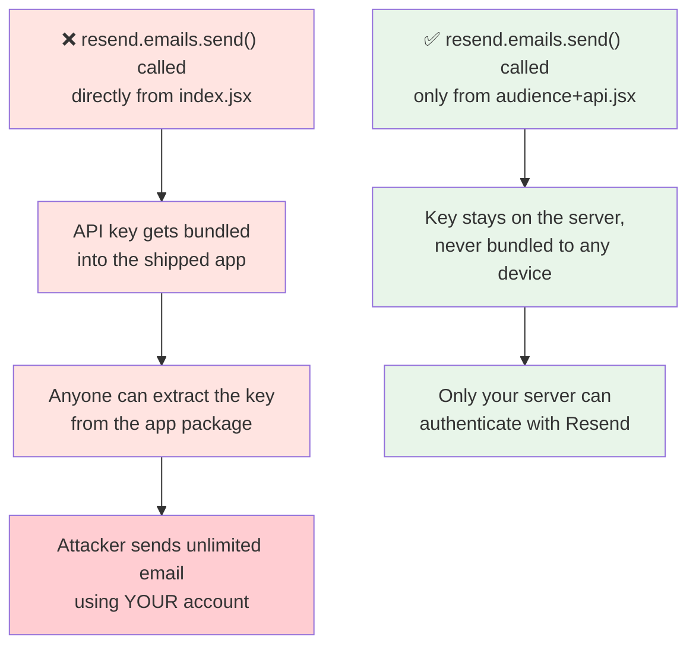

Even though `resend.emails.send()` is "just one function call," calling it
from `index.jsx` would require `RESEND_API_KEY` to be readable by client
code — and any variable readable by client code either needs the
`EXPO_PUBLIC_` prefix (making it public by design) or simply isn't
reachable at all in that context. There is no safe way to use a secret key
from the client. The API route exists specifically to solve this.

### 13.3 A short checklist

- [ ] `.env.local` is listed in `.gitignore`.
- [ ] `RESEND_API_KEY` has no `EXPO_PUBLIC_` prefix.
- [ ] The Resend SDK is only imported inside `+api.jsx` files.
- [ ] Server-side input validation exists, even if the client also
      validates.
- [ ] Error responses don't leak internal details (stack traces, raw
      exception messages) to the client.


---

## 14. Common Errors

> **📘 Chapter Goal:** Diagnose and fix the mistakes almost everyone makes
> the first time they wire this up.

| Error / Symptom | Cause | Reason | Solution |
|---|---|---|---|
| `Network request failed` | `BASE_URL` is wrong or the dev server isn't running | The client can't reach the API route at all | Confirm `npx expo start` is running and `EXPO_PUBLIC_BASE_URL_LOCAL` matches the printed local address |
| `Missing required fields` (400) | Form submitted with an empty field | Server-side validation caught incomplete data | Ensure `to`, `subject`, and `message` all have values before submitting |
| `RESEND_API_KEY is not defined` / auth error from Resend | `.env.local` missing or not loaded | The server route can't authenticate with Resend | Verify `.env.local` exists, contains `RESEND_API_KEY`, and restart the dev server after editing it |
| Email sends in dev but not in production | `EXPO_PUBLIC_BASE_URL` not set to your deployed URL | The production client is calling the wrong (or no) server | Set `EXPO_PUBLIC_BASE_URL` to your real EAS Hosting URL and redeploy |
| `Cannot find module 'resend'` | The SDK wasn't installed | `npm install resend` was skipped | Run `npm install resend` from the project root |
| App works locally, 404s in production for `/api/audience` | `app.json` missing `"output": "server"` | Without this, API routes aren't included in the exported build | Set `"web": { "output": "server" }` in `app.json`, then re-export and redeploy |
| Emails land in spam | Using an unverified "from" domain | Deliverability depends on domain authentication | Verify a real sending domain in the Resend dashboard and use it as your `from` address |
| `JSON.parse` error on the server | Client sent a non-JSON body, or wrong `Content-Type` header | `request.json()` expects valid JSON with the right header | Ensure `headers: { "Content-Type": "application/json" }` is set and `body` is created with `JSON.stringify()` |
| Changes to `.env.local` don't take effect | Dev server was not restarted | Environment variables are read once, at server startup | Stop and restart `npx expo start` after editing environment variables |
| `TypeError: Cannot read properties of undefined` in `POST` | Destructuring fields from a body that wasn't JSON | `request.json()` failed silently or body was empty | Confirm the client sends a proper JSON body with all expected fields |

---

## 15. FAQ

> **📘 Chapter Goal:** Answer the questions a total beginner is likely to
> have, in plain language.

**1. What is `fetch`?**
A built-in JavaScript function for making HTTP requests to a server from either a browser or a React Native app.

**2. What is `POST`?**
An HTTP method used to send data to a server so it can create or process something, as opposed to just reading data.

**3. Why JSON?**
JSON (JavaScript Object Notation) is a lightweight, text-based format that both JavaScript and virtually every other language can easily read and write, making it the standard format for APIs.

**4. Why `await`?**
Because network requests take time. `await` pauses your `async` function until the operation finishes, without freezing the rest of the app.

**5. Why `Response.json()`?**
It's a shortcut that converts a JavaScript object into a properly formatted JSON HTTP response, with the correct headers set automatically.

**6. Why API Routes?**
They let you write backend logic (like calling Resend with a secret key) inside the same Expo Router project, without standing up a separate server.

**7. Why Expo Router?**
It gives you file-based routing for both screens and API routes in one unified framework, so your whole app — frontend and backend — lives in one codebase.

**8. What does `+api.jsx` mean?**
It's a naming convention Expo Router recognizes: any file ending in `+api` (before the extension) is treated as a server route, not a screen.

**9. Can I use `GET` instead of `POST`?**
Technically yes, but `POST` is the correct semantic choice here because we're asking the server to perform an action (send an email) using data we supply.

**10. Do I need a database for this project?**
No. This guide only sends transactional emails; no data is stored anywhere.

**11. Is Resend free to use?**
Resend offers a free tier suitable for learning and small projects; check resend.com for current limits and pricing.

**12. Can I send to multiple recipients at once?**
Yes — the `to` field in `resend.emails.send()` accepts an array of email addresses.

**13. What happens if the user has no internet connection?**
The `fetch()` call will reject, which is caught by the `catch` block, showing the user an error alert.

**14. Why do we validate on the server if we could validate on the client?**
Because client-side code can be bypassed entirely (someone could call your API route directly), so server validation is the only validation you can actually trust.

**15. What is `process.env`?**
A JavaScript object provided by the runtime that holds environment variables as key-value string pairs.

**16. Why does the API key start with `re_`?**
That prefix is simply Resend's convention for identifying their API keys at a glance; it has no functional effect on your code.

**17. Can I test sending emails without a real domain?**
Yes — Resend provides a testing sender address (`onboarding@resend.dev`) for exactly this purpose.

**18. What's the difference between `.env.example` and `.env.local`?**
`.env.example` is a committed template with placeholder values; `.env.local` holds your real, secret values and is never committed.

**19. Why is my API key undefined even though it's in `.env.local`?**
Most likely the dev server wasn't restarted after you added it — environment variables load at server startup.

**20. Can this same pattern work for other providers besides Resend?**
Yes — the client/server split (call your own API route, which calls the third-party service) applies to any provider requiring a secret key: Stripe, Twilio, OpenAI, and more.

**21. What does `async` actually do to a function?**
It makes the function always return a Promise and allows the use of `await` inside its body.

**22. What is a Promise?**
An object representing a value that isn't available yet but will be at some point — either resolved (success) or rejected (failure).

**23. Why use `try/catch` instead of ignoring errors?**
Ignoring errors leads to silent failures and crashes; `try/catch` lets you handle problems gracefully and inform the user.

**24. What is `Alert.alert` versus `console.log`?**
`console.log` writes to the developer console, invisible to end users; `Alert.alert` shows a native popup the user actually sees.

**25. Is `index.jsx` required to be named exactly that?**
Yes, if you want it to represent the root `/` route — Expo Router relies on this specific filename convention.

**26. Can I rename `audience+api.jsx`?**
Yes — the name before `+api` becomes the route segment. Renaming it to `send+api.jsx` would change the route to `/api/send`.

**27. Do I need to install Expo Router separately?**
It's included when you create a project with the Expo Router template, and configured via the `expo-router` plugin in `app.json`.

**28. What's the difference between `EXPO_PUBLIC_BASE_URL` and `EXPO_PUBLIC_BASE_URL_LOCAL`?**
One points to your deployed production API; the other points to your local development server. The app picks between them using `__DEV__`.

**29. Why wrap `to` in an array (`to: [to]`) in the backend code?**
Because Resend's API accepts a list of recipients, even when you're only sending to one person.

**30. What status code should errors return?**
Use `400` for client mistakes (like missing fields) and `500` for unexpected server-side failures.

**31. Can I add CC or BCC recipients?**
Yes — the Resend SDK's `emails.send()` method supports `cc` and `bcc` fields alongside `to`.

**32. Does this project require a Mac to develop on?**
No — Expo development works on Windows, macOS, and Linux; only building certain native iOS binaries directly (outside of EAS) requires a Mac.

---

## 16. Glossary

> **📘 Chapter Goal:** A quick-reference dictionary for every important
> term used throughout this guide.

| Term | Definition |
|---|---|
| **API** | Application Programming Interface — a defined way for two programs to communicate. |
| **SDK** | Software Development Kit — a package of pre-built tools (like the `resend` npm package) that make using a service easier than calling its raw API by hand. |
| **HTTP** | HyperText Transfer Protocol — the standard protocol used to transmit requests and responses across the web. |
| **JSON** | JavaScript Object Notation — a lightweight, text-based data format widely used by APIs. |
| **POST** | An HTTP method used to send data to a server, typically to create or trigger something. |
| **GET** | An HTTP method used to retrieve data from a server without modifying anything. |
| **Request** | A message sent from a client to a server asking it to do something. |
| **Response** | The message a server sends back to a client after processing a request. |
| **Environment Variable** | A named value provided outside your source code by the runtime environment, often used for configuration and secrets. |
| **Hosting** | A service that runs your application on servers accessible over the internet. |
| **Deployment** | The process of publishing your application so it's live and reachable by users. |
| **Webhook** | A mechanism where a service automatically sends an HTTP request to your server when a specific event happens (e.g., Resend notifying you of a bounced email). |
| **Domain** | A human-readable web address (like `resend.dev`) that maps to a server; also used for verifying who is allowed to send email "from" an address. |
| **SMTP** | Simple Mail Transfer Protocol — the underlying protocol email servers use to transmit messages. |
| **Authentication** | The process of proving *who* you are (e.g., an API key proving your app is allowed to use Resend). |
| **Authorization** | The process of determining *what* an authenticated party is allowed to do. |
| **Server** | A program (and often the machine it runs on) that listens for requests and responds to them; runs somewhere the developer controls. |
| **Client** | The program that initiates requests to a server; in this guide, the React Native app running on a user's device. |
| **Backend** | The server-side portion of an application — logic, data access, and integrations that don't run on the user's device. |
| **Frontend** | The client-side portion of an application — the UI the user actually sees and interacts with. |
| **Route** | A specific URL path an application knows how to respond to, whether with a screen (client) or a handler function (server). |
| **Bundle** | The compiled, packaged version of your JavaScript code that actually ships to and runs on a device. |
| **Promise** | A JavaScript object representing an operation that hasn't finished yet, but will eventually resolve or reject. |
| **Async/Await** | JavaScript syntax that lets you write asynchronous, Promise-based code in a way that reads like ordinary sequential code. |
| **CDN** | Content Delivery Network — a distributed set of servers that cache and serve static assets quickly, close to the end user. |
| **Serverless Function** | A small unit of server-side code (like our `POST` handler) that a cloud provider runs on demand, without you managing a persistent server process. |


---

<div align="center">

### 🎉 You made it to the end!

You now understand not just *how* to send email from an Expo Router app
with Resend, but *why* every architectural decision in this guide exists.

**Built with ❤️ for developers learning from first principles.**

[⬆ Back to top](#-expo-resend-guide)

</div>